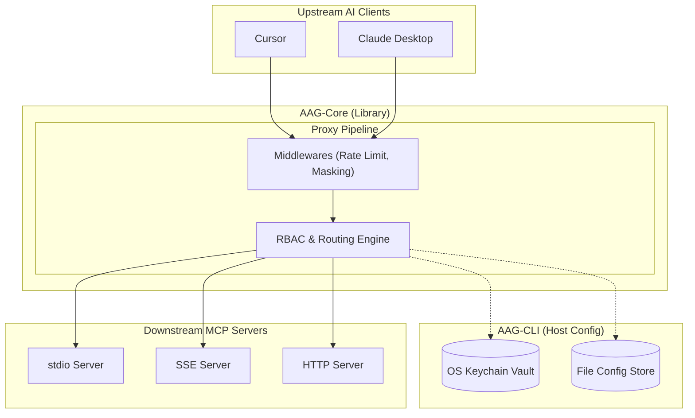
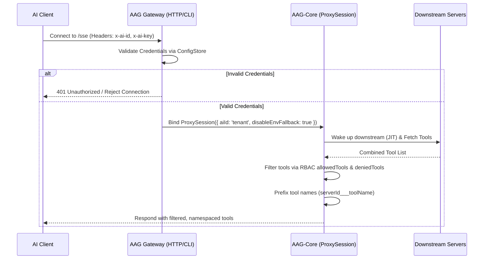
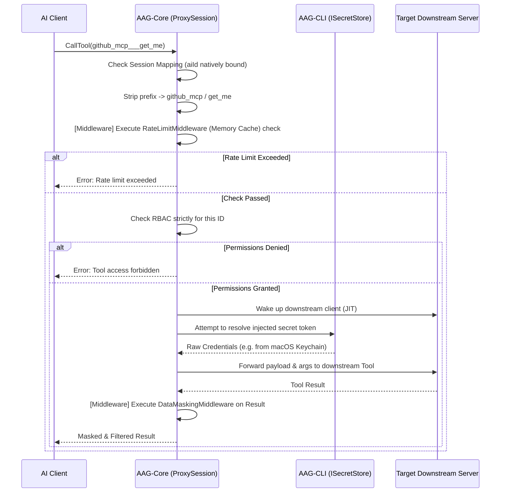

# AI Auth Gateway - System Architecture

This document describes the high-level architecture, core components, and data flow of the **AI Auth Gateway**.

## 1. High-Level Overview

The **AI Auth Gateway** acts as a secure intermediary (proxy) between upstream AI Clients (e.g., Claude Desktop, Cursor, Antigravity) and multiple downstream Model Context Protocol (MCP) servers.

The system enforces **Upstream Authentication**, requiring connecting clients to prove their identity via an `AI_ID` and `AI_KEY` before interacting with the proxy. It also handles **Downstream Authentication Injection**, seamlessly adding necessary secrets (JWTs, API Keys, PATs) to requests destined for external tools without exposing those secrets to the upstream AI clients.

### Premium Architecture Visualization (v1.0.8)

---

## 2. Core Components

The architecture is built as a **Monorepo** on top of the official `@modelcontextprotocol/sdk`. It separates the highly reusable, OS-agnostic `@cyber-sec.space/aag-core` (Core Library) from the `ai-auth-gateway` (CLI Application) via strict Dependency Injection (`ISecretStore`, `IConfigStore`, `IAuditLogger`).

### A. The Server Proxy (`ProxyServer` in `@cyber-sec.space/aag-core`)
- **Transport**: Listens for incoming connections from AI Clients via Server-Sent Events (SSE) or STDIO.
- **Authentication**: Validates incoming `AI_ID` and `AI_KEY` against authorized entities via the injected `IConfigStore`.
- **Protocol Emulation**: Intercepts standard MCP requests (`ListToolsRequestSchema`, `CallToolRequestSchema`) and multiplexes them across multiple downstream servers.
- **Middleware Pipeline**: Implements a `use()` pattern allowing interception and mutation during the `onRequest` and `onResponse` phases.

### B. The Client Manager (`ClientManager` in `@cyber-sec.space/aag-core`)
- **Multiplexing**: Manages a pool of downstream MCP clients, each connected to a different target server.
- **Transport Support**: Supports `stdio`, `sse`, and `http` downstream transports.
- **Lifecycle**: Handles connection, disconnection, and error recovery for downstream services.

### C. The Configuration Manager & Storage Interfaces
- **Core Interfaces (`IConfigStore`, `ISecretStore`)**: The core proxy is completely agnostic to how secrets and configs are stored, making it easy to swap implementations for enterprise databases or Hashicorp Vault.
- **CLI Implementations (Project Root)**: The main CLI application injects `FileConfigStore` (watching `mcp-proxy-config.json` via `chokidar`) and `KeychainSecretStore` (encrypting and storing via OS `keytar`) into the core.

### D. Role-Based Access Control (RBAC) Engine
- Integrated directly into the proxy, the RBAC engine filters which tools an AI is allowed to see and call based on granular whitelists and blacklists defined per `AIKey`.
- Tools from multiple downstream servers are aggregated and namespaced (e.g., `${serverId}___${toolName}`) to prevent collisions.

### E. Secure Logging System (`src/utils/logger.ts`)
- **Centralized Tracing**: Records all proxy activities, including successful authentications, specific tool calls, and permission denials.
- **Data Masking**: Automatically identifies and masks sensitive data (such as API Keys, AI Keys, or Authorization Headers) before logging to `logs/proxy.log` or the console, ensuring secrets never leak.

### F. The CLI (`aagcli`)
A complete command-line interface (`src/commands/`) requiring `sudo` privileges to manage the gateway:
- **`config`**: Manage system settings like port and log levels.
- **`mcp`**: Discover online downstream servers and live tool configurations.
- **`ai`**: Register AI clients, revoke keys, and manage granular RBAC permissions.
- **`keychain`**: Securely store downstream API keys directly in the host OS's secure storage.
- **`stdio-path`**: Resolves the absolute path of the compiled `stdio.js` script for local AI clients.

### G. Built-in Middleware
The core library provides out-of-the-box protection layers:
- **RateLimitMiddleware**: Enforces Requests Per Minute (RPM) or Per Hour (RPH) limits via a "Token Bucket" algorithm. Optimized via zero-latency in-memory cache reads (`getConfig()`), reacting dynamically to `mcp-proxy-config.json` changes without disk I/O.
- **DataMaskingMiddleware**: Uses RegEx-based interceptors to automatically filter out API Keys (e.g., `sk-...`), passwords, or PII from downstream tool results.

---

## 3. Data Flow

### 3.1. Authentication & Discovery Flow

### 3.2. Tool Execution Flow (CallTool)

### 3.3. Key Management & Encryption Flow
To ensure absolute security when storing downstream API keys on the host machine, the Gateway employs a dual-layer security model integrating the OS Keychain (`keytar`) and AES-256-GCM encryption (`CryptoService`).

**Writing a Secret (e.g., via `aagcli keychain set`)**:
1. The CLI reads the `masterKey` (a 64-char hex string automatically generated on first boot) from `mcp-proxy-config.json`.
2. The `CryptoService` encrypts the raw user plaintext (e.g., `sk-12345...`) using the `masterKey` via AES-256-GCM, generating an `iv:authTag:encryptedText` payload.
3. This already-encrypted payload is handed over to `keytar` (`libsecret`/Keychain/Credential Manager), which stores it safely within the operating system's native vault.

**Reading a Secret (During Tool Execution)**:
1. The `ConfigManager` encounters an injection string like `keytar://github/pat`.
2. It requests `keytar` to fetch the saved payload for `service: github`, `account: pat`.
3. `keytar` unlocks the OS vault and returns the encrypted payload.
4. The `CryptoService` uses the `masterKey` from `mcp-proxy-config.json` to decrypt the payload back into the raw API key.
5. The raw key exists *only in memory* strictly during the downstream request, and is immediately discarded.
