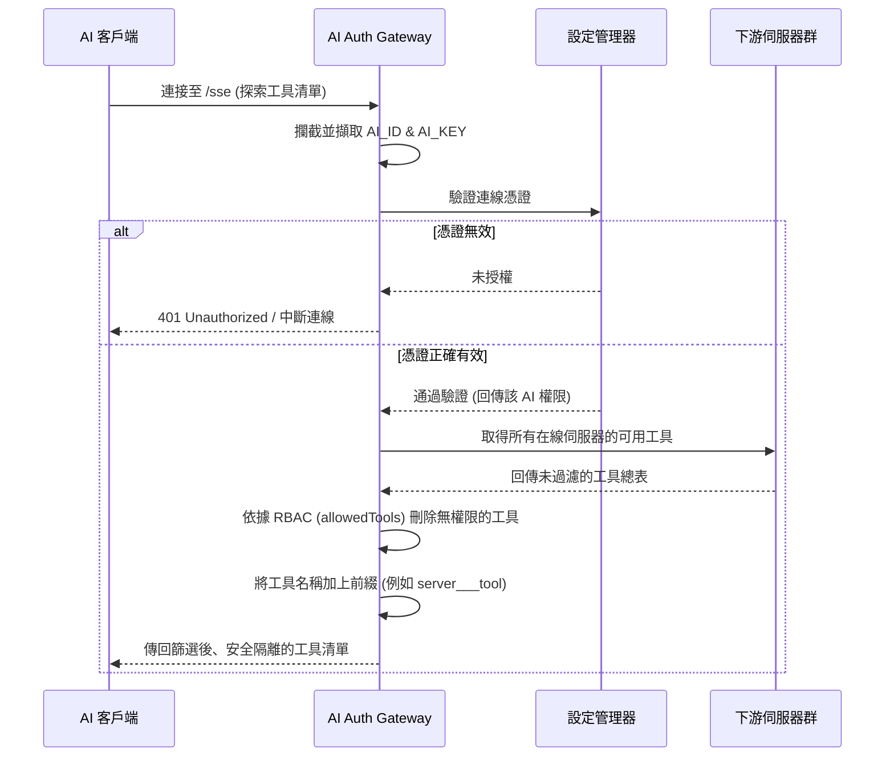
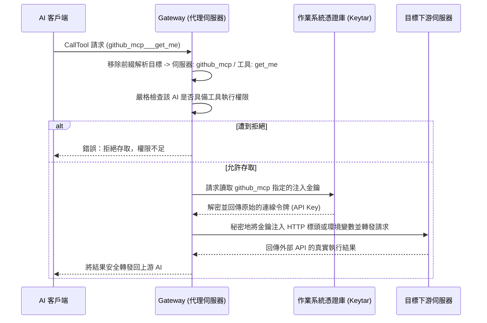

# AI Auth Gateway - 系統架構

本文件描述 **AI Auth Gateway** 的高層級架構、核心組件以及資料流程。

## 1. 高層級概述

**AI Auth Gateway** 旨在充當上游 AI 客戶端（例如 Claude Desktop, Cursor, Antigravity）與下游多個 Model Context Protocol (MCP) 伺服器之間的安全中介代理 (Proxy)。

系統強制實施 **上游身份驗證 (Upstream Authentication)**，要求連接的客戶端必須透過 `AI_ID` 與 `AI_KEY` 來證明其身份，方能與代理伺服器互動。同時，系統也處理 **下游驗證注入 (Downstream Authentication Injection)**，將必要的機密憑證（如 JWT、API 金鑰、PAT）無縫加入發往外部工具的請求中，而無需將這些機密暴露給上游 AI 客戶端。

---

## 2. 核心組件

此架構建構於官方的 `@modelcontextprotocol/sdk` 之上，主要包含以下六個核心支柱：

### A. 代理伺服器核心 (`src/proxy.ts` & `src/index.ts`)
- **傳輸層**: 透過 Server-Sent Events (SSE) 監聽來自 AI 客戶端的連線。
- **身份驗證**: 將傳入的 `AI_ID` 和 `AI_KEY` 與設定檔中已授權的實體進行比對驗證。
- **協定模擬**: 攔截標準 MCP 請求（如 `ListToolsRequestSchema`、`CallToolRequestSchema`）並將其分發到多個下游伺服器。

### B. 客戶端管理器 (`src/clientManager.ts`)
- **多路復用 (Multiplexing)**: 管理一個下游 MCP 客戶端池，每個客戶端皆連接著不同的目標伺服器。
- **傳輸支援**: 支援使用 `stdio`、`sse` 以及 `http` 與下游進行通訊。
- **生命週期**: 處理下游服務的連線、斷線及錯誤復原。

### C. 設定管理器 (`src/config.ts`)
- **單一事實來源**: 讀取與寫入 `mcp-proxy-config.json`，並利用 `chokidar` 監控檔案變更以達到熱重載 (Hot-reload)。
- **主金鑰加密**: 生成並管理用來加解密透過作業系統憑證庫 (`keytar`) 傳遞敏感資料的 `masterKey`。
- **機密解析**: 動態解析 `authInjection` 的值，無論它們是原始字串、環境變數 (`$VAR`) 還是憑證庫參照 (`keytar://service/account`)。

### D. 基於角色的存取控制 (RBAC) 引擎
- 直接整合於代理層，RBAC 引擎可根據每個 `AIKey` 所定義的精細白名單與黑名單，過濾 AI 能看到及呼叫的工具。
- 來自多個下游伺服器的工具會被彙總並加上命名空間（例如 `${serverId}___${toolName}`）以防止名稱衝突。

### E. 安全日誌系統 (`src/utils/logger.ts`)
- **集中追蹤**: 記錄所有代理活動，包含驗證成功、特定的工具呼叫以及權限拒絕等行為。
- **資料遮罩**: 系統會自動辨識並遮罩敏感資料（如 API 金鑰、AI 金鑰或 Authorization 標頭），確保機密不會外洩到 `logs/proxy.log` 或是終端機console。

### F. 命令列介面 (`aagcli`)
這是實作於 `src/commands/` 的完整 CLI 工具，需要 `sudo` 權限執行以管理整個閘道：
- **`config`**: 管理系統設定（如啟動端口與日誌級別）。
- **`mcp`**: 探索在線的下游伺服器與可用的工具清單。
- **`ai`**: 註冊 AI 客戶端、撤銷金鑰並管理精細的 RBAC 權限。
- **`keychain`**: 將下游 API 金鑰安全地儲存在底層作業系統的加密憑證庫中。

---

## 3. 資料流程

### 3.1. 驗證與探索 (Discovery) 流水線

### 3.2. 工具執行流程 (CallTool)

### 3.3. 金鑰管理與加解密流程
為了確保儲存在主機系統上的下游 API 金鑰具備絕對的安全性，Gateway 採用了雙層安全模型：結合了作業系統憑證庫 (`keytar`) 以及 AES-256-GCM 加密技術 (`CryptoService`)。

**寫入機密 (例如：透過 `aagcli keychain set`)**:
1. CLI 會從 `mcp-proxy-config.json` 讀取 `masterKey`（這是在系統初次啟動時自動生成的 64 字元長度 Hex 字串）。
2. `CryptoService` 使用該 `masterKey` 透過 AES-256-GCM 演算法將使用者的原始密碼（例如 `sk-12345...`）加密，產生一組 `iv:authTag:加密內容` 的 Payload。
3. 程式將這組**已經加密過**的 Payload 交付給 `keytar` (`libsecret` / 鑰匙圈 / 憑證管理員)，安全地存入作業系統原生的保護庫中。

**讀取機密 (在代理執行階段)**:
1. `ConfigManager` 若遇到設定字串如 `keytar://github/pat`，會準備進行機密解析。
2. 它向 `keytar` 發出請求，抓取 `service: github`、`account: pat` 的儲存資料。
3. `keytar` 解鎖 OS 原生憑證庫並回傳上述那組加密過的 Payload。
4. `CryptoService` 隨即使用 `mcp-proxy-config.json` 中的 `masterKey` 將該 Payload 解密還原成原始的 API 金鑰。
5. 這把原始金鑰**只會短暫存在於記憶體中**以執行當下的代理請求，一旦傳輸結束便會立即回收，絕不落地。
